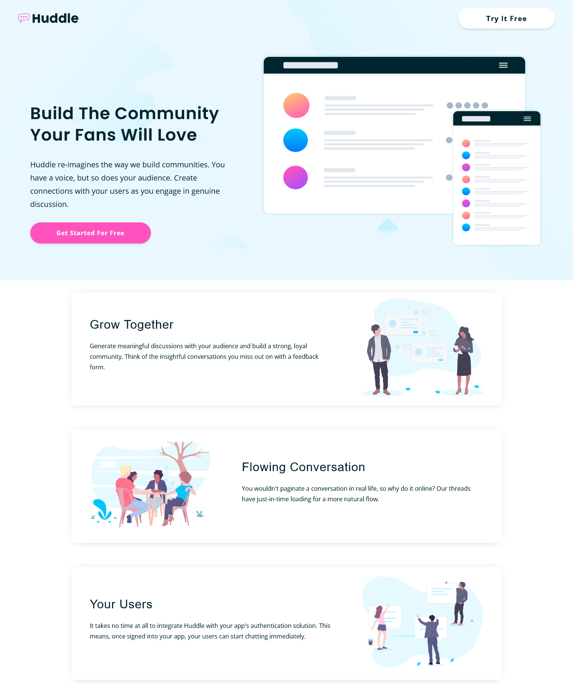

# Frontend Mentor - Huddle landing page with alternating feature blocks solution

This is a solution to the [Huddle landing page with alternating feature blocks challenge on Frontend Mentor](https://www.frontendmentor.io/challenges/huddle-landing-page-with-alternating-feature-blocks-5ca5f5981e82137ec91a5100). Frontend Mentor challenges help you improve your coding skills by building realistic projects.

## Table of contents

- [Overview](#overview)
  - [The challenge](#the-challenge)
  - [Screenshot](#screenshot)
  - [Links](#links)
- [My process](#my-process)
  - [Built with](#built-with)
  - [What I learned](#what-i-learned)
  - [Continued development](#continued-development)
  - [Useful resources](#useful-resources)
- [Author](#author)
- [Acknowledgments](#acknowledgments)

## Overview

### The challenge

Users should be able to:

- View the optimal layout for the site depending on their device's screen size
- See hover states for all interactive elements on the page

### Screenshot



### Links

- Solution URL: [Add solution URL here](https://your-solution-url.com)
- Live Site URL: [Add live site URL here](https://your-live-site-url.com)

## My process

-still workin on the footer

### Built with

- Semantic HTML5 markup
- CSS custom properties
- Flexbox

### What I learned

```css
.proud-of-this-css {
	background-attachment: fixed;
	/* eventhough it seems like I didn't need it in the end but it was helpfull through the process and I will definetly use it in the future */
}

.proud-of-this-css2 {
	filter: brightness(0) invert(1);
}
/* this helped me to change the color of the given logo without the need of another logo which I will definetly need in my future project */
```

I also discovered this great source which i will defenitely use for my next documentation :
[The Markdown Guide](https://www.markdownguide.org/).

### Continued development

I need to focus more with the Flexbox tools even though I did well, but there is too much more to discover with this wonderful tool, also I need to learn more about Grid, that would be helpfull with such a project.

### Useful resources

- [Example resource 1](https://www.youtube.com) - YouTube as always is a helpfullresource for fixing bugs here and there.
- [Example resource 2](https://fontawesome.com) - I Used fontawsome for icons.

## Author

- Github - [@Njoura7](https://github.com/Njoura7)
- Frontend Mentor - [@Njoura7](https://www.frontendmentor.io/profile/Njoura7)
- LinkedIn - [@Aziz_Najjar](https://www.linkedin.com/in/aziz-najjar-400672200/)

## Acknowledgments

This is where you can give a hat tip to anyone who helped you out on this project. Perhaps you worked in a team or got some inspiration from someone else's solution. This is the perfect place to give them some credit.
